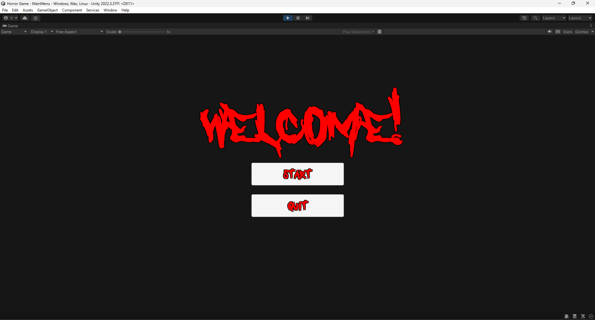
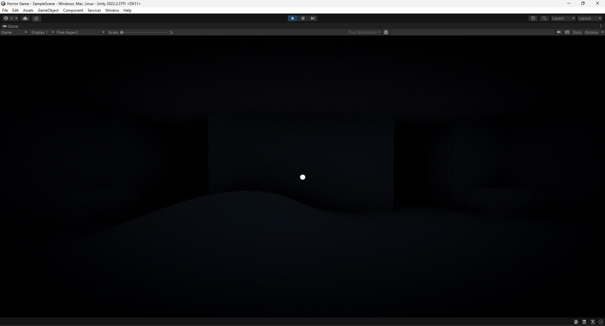
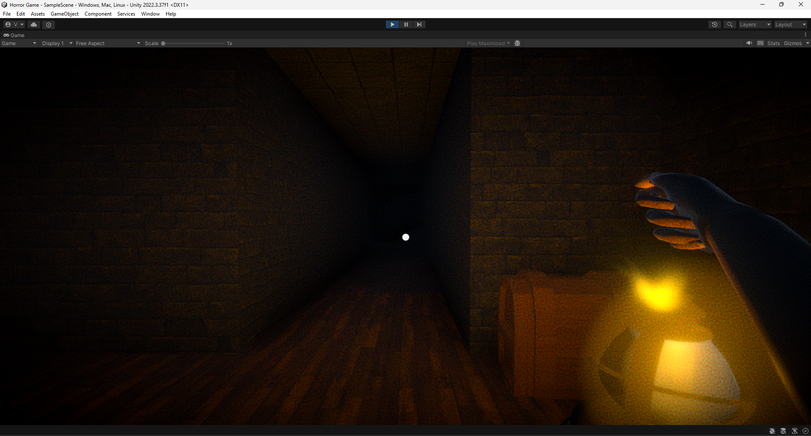
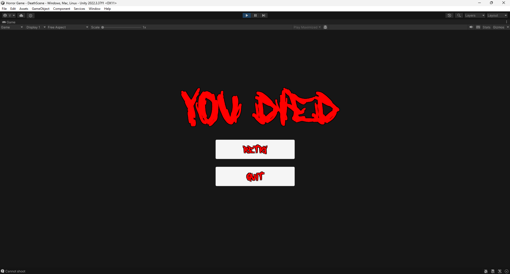

# Horror Maze Game

## Giới thiệu

**Horror Maze Game** là một trò chơi kinh dị sinh tồn, nơi người chơi phải khám phá một mê cung bí ẩn để tìm các vật phẩm quan trọng và chìa khóa nhằm thoát khỏi nơi nguy hiểm. Tuy nhiên, không chỉ có mê cung là kẻ thù của bạn — một con quái vật khát máu luôn lảng vảng trong bóng tối, tìm kiếm bạn. Bạn phải vận dụng sự tinh quái và kỹ năng ẩn nấp để tránh bị phát hiện và thoát khỏi mê cung đầy rẫy nguy hiểm.

## Tính năng nổi bật

- **Mê cung ngẫu nhiên**: Mỗi lần chơi, mê cung sẽ được tạo ngẫu nhiên, mang lại trải nghiệm mới mẻ và khác biệt mỗi lần khám phá.

- **Tìm kiếm vật phẩm và chìa khóa**: Bạn phải tìm các vật phẩm đặc biệt để hỗ trợ thoát khỏi mê cung, và chìa khóa để mở cánh cửa cuối cùng.

- **Tránh né quái vật**: Một con quái vật luôn lùng sục trong mê cung, truy đuổi và săn tìm người chơi. Nếu bị bắt gặp, bạn sẽ gặp kết cục thảm khốc.

- **Yếu tố kinh dị**: Trò chơi có bầu không khí kinh dị với âm thanh rùng rợn và ánh sáng yếu, tạo nên sự căng thẳng khi khám phá mê cung.

- **Chơi sinh tồn**: Người chơi phải quản lý thời gian và tài nguyên hợp lý để vừa tìm kiếm vật phẩm vừa tránh xa quái vật.

## Yêu cầu hệ thống

- **Hệ điều hành**: Windows 10 hoặc cao hơn
- **Bộ xử lý**: Intel Core i5 hoặc tương đương
- **RAM**: 8GB
- **Card đồ họa**: NVIDIA GTX 1050 hoặc tương đương
- **Dung lượng ổ cứng**: 5GB dung lượng trống
- **Âm thanh**: Tai nghe khuyến khích để có trải nghiệm tốt hơn

## Hướng dẫn cài đặt
- Di chuyển: Sử dụng các phím W, A, S, D để điều khiển nhân vật.
- Tìm vật phẩm: Khám phá mê cung để thu thập vật phẩm cần thiết.
- Tránh quái vật: Ẩn nấp và tránh bị quái vật phát hiện. Chạy ngay khi thấy nguy hiểm.
- Thoát khỏi mê cung: Tìm chìa khóa và sử dụng nó để mở cánh cửa thoát hiểm.

## Hình Ảnh

- **HUB:**
  

- **StartGame:**
  

- **Item:**
  

- **Dead:**
  
  

## Người thực hiện
- **[Vo Trung Kien](https://github.com/KaeseyVNK)** - Fullstack

## Nguồn học tập 
- https://www.youtube.com/watch?v=CG81OmTgv-4
